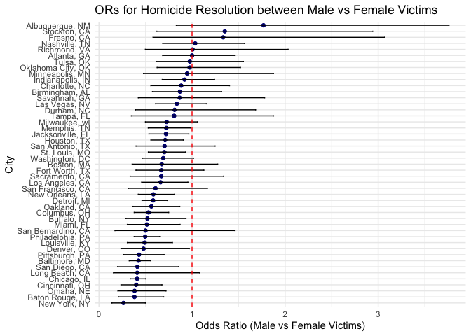
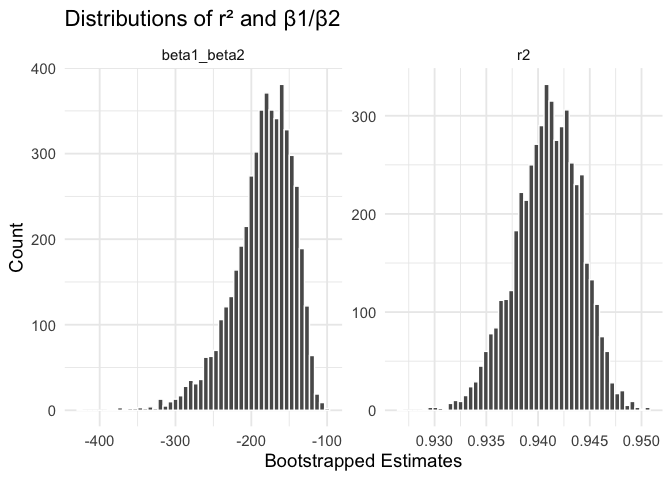
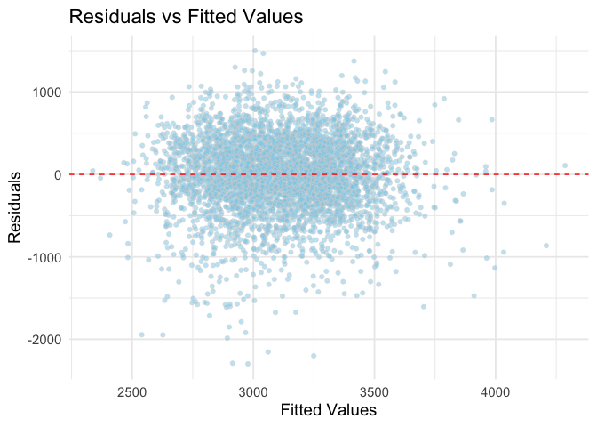
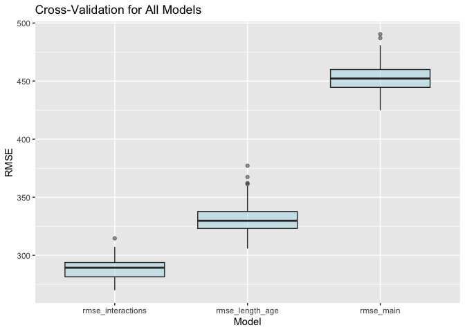

p8105_hw5_tp2806
================
Tejashree Prakash

# Problem 1

#### Cleaning the data.

``` r
#Load data
homicide_df <- read_csv("data/homicide-data.csv")
```

    ## Rows: 52179 Columns: 12
    ## ── Column specification ────────────────────────────────────────────────────────
    ## Delimiter: ","
    ## chr (9): uid, victim_last, victim_first, victim_race, victim_age, victim_sex...
    ## dbl (3): reported_date, lat, lon
    ## 
    ## ℹ Use `spec()` to retrieve the full column specification for this data.
    ## ℹ Specify the column types or set `show_col_types = FALSE` to quiet this message.

``` r
#Add city_state variable 
homicide_df <- homicide_df %>%
  mutate(city_state = str_c(city, ", ", state))

#Add homicide variable 
homicide_df <- homicide_df %>%
  mutate(
    resolved = as.numeric(disposition == "Closed by arrest"),
    victim_age = as.numeric(victim_age),
    victim_race = fct_relevel(victim_race, "White")) %>%
  filter(!city_state %in% c("Dallas, TX", "Phoenix, AZ", "Kansas City, MO", "Tulsa, AL")) %>%
  filter(victim_race %in% c("White", "Black"))
```

    ## Warning: There was 1 warning in `mutate()`.
    ## ℹ In argument: `victim_age = as.numeric(victim_age)`.
    ## Caused by warning:
    ## ! NAs introduced by coercion

``` r
head(homicide_df, 5)
```

    ## # A tibble: 5 × 14
    ##   uid   reported_date victim_last victim_first victim_race victim_age victim_sex
    ##   <chr>         <dbl> <chr>       <chr>        <fct>            <dbl> <chr>     
    ## 1 Alb-…      20100601 SATTERFIELD VIVIANA      White               15 Female    
    ## 2 Alb-…      20100102 MULA        VIVIAN       White               72 Female    
    ## 3 Alb-…      20100126 BOOK        GERALDINE    White               91 Female    
    ## 4 Alb-…      20100130 MARTIN-LEY… GUSTAVO      White               56 Male      
    ## 5 Alb-…      20100218 LUJAN       KEVIN        White               NA Male      
    ## # ℹ 7 more variables: city <chr>, state <chr>, lat <dbl>, lon <dbl>,
    ## #   disposition <chr>, city_state <chr>, resolved <dbl>

#### Performing regression model for Baltimore.

``` r
baltimore_df <- homicide_df %>%
  filter(city_state == "Baltimore, MD")

baltimore_log <- 
  baltimore_df %>% 
  glm(resolved ~ victim_age + victim_race + victim_sex, 
      data = ., 
      family = binomial()) 

baltimore_log_results <- baltimore_log %>%
  broom::tidy() %>% 
  mutate(OR = exp(estimate)) %>%
  select(term, log_OR = estimate, OR, p.value) %>%
  filter(term == "victim_sexMale")

baltimore_log_results <- baltimore_log %>%
  tidy() %>%
  mutate(
    OR = exp(estimate),
    ci_lower = exp(estimate - 1.96 * std.error),
    ci_upper = exp(estimate + 1.96 * std.error)
  ) |>
  filter(term == "victim_sexMale") %>%
  select(term, log_OR = estimate, OR, ci_lower, ci_upper, p.value
  )

baltimore_log_results |> 
  knitr::kable(digits = 3)
```

| term           | log_OR |    OR | ci_lower | ci_upper | p.value |
|:---------------|-------:|------:|---------:|---------:|--------:|
| victim_sexMale | -0.854 | 0.426 |    0.325 |    0.558 |       0 |

#### Performing log for each city.

``` r
nest_city_results <-
  homicide_df |> 
  nest(data = -city_state) %>%
  mutate(
    models = map(data, \(df) glm(resolved ~ victim_sex + victim_age + victim_race, 
      data = df, 
      family = binomial())
      ),
    results = map(models, broom::tidy)
    ) %>%
  select(-data, -models) %>%
  unnest(results) %>%
  mutate(OR = exp(estimate)) %>% 
  filter(term == "victim_sexMale") %>% 
  group_by(city_state) %>%
  mutate(
    ci_lower = exp(estimate - 1.96 * std.error),
    ci_upper = exp(estimate + 1.96 * std.error)
  ) %>%
  ungroup()

nest_city_results %>% 
  arrange(OR) %>%
  select(city_state, OR, p.value, ci_lower, ci_upper) %>%
  knitr::kable(digits = 3)
```

| city_state         |    OR | p.value | ci_lower | ci_upper |
|:-------------------|------:|--------:|---------:|---------:|
| New York, NY       | 0.262 |   0.000 |    0.138 |    0.499 |
| Baton Rouge, LA    | 0.381 |   0.002 |    0.209 |    0.695 |
| Omaha, NE          | 0.382 |   0.003 |    0.203 |    0.721 |
| Cincinnati, OH     | 0.400 |   0.001 |    0.236 |    0.677 |
| Chicago, IL        | 0.410 |   0.000 |    0.336 |    0.501 |
| Long Beach, CA     | 0.410 |   0.072 |    0.156 |    1.082 |
| San Diego, CA      | 0.413 |   0.017 |    0.200 |    0.855 |
| Baltimore, MD      | 0.426 |   0.000 |    0.325 |    0.558 |
| Pittsburgh, PA     | 0.431 |   0.001 |    0.265 |    0.700 |
| Denver, CO         | 0.479 |   0.041 |    0.236 |    0.971 |
| Louisville, KY     | 0.491 |   0.003 |    0.305 |    0.790 |
| Philadelphia, PA   | 0.496 |   0.000 |    0.378 |    0.652 |
| San Bernardino, CA | 0.500 |   0.206 |    0.171 |    1.462 |
| Miami, FL          | 0.515 |   0.013 |    0.304 |    0.872 |
| Buffalo, NY        | 0.521 |   0.029 |    0.290 |    0.935 |
| Columbus, OH       | 0.532 |   0.000 |    0.378 |    0.750 |
| Oakland, CA        | 0.563 |   0.009 |    0.365 |    0.868 |
| Detroit, MI        | 0.582 |   0.000 |    0.462 |    0.734 |
| New Orleans, LA    | 0.585 |   0.001 |    0.422 |    0.811 |
| San Francisco, CA  | 0.608 |   0.134 |    0.317 |    1.165 |
| Los Angeles, CA    | 0.662 |   0.028 |    0.458 |    0.956 |
| Sacramento, CA     | 0.669 |   0.255 |    0.335 |    1.337 |
| Fort Worth, TX     | 0.669 |   0.131 |    0.397 |    1.127 |
| Boston, MA         | 0.674 |   0.226 |    0.356 |    1.276 |
| Washington, DC     | 0.690 |   0.061 |    0.468 |    1.017 |
| St. Louis, MO      | 0.703 |   0.014 |    0.530 |    0.932 |
| San Antonio, TX    | 0.705 |   0.230 |    0.398 |    1.249 |
| Houston, TX        | 0.711 |   0.006 |    0.558 |    0.907 |
| Jacksonville, FL   | 0.720 |   0.028 |    0.537 |    0.966 |
| Memphis, TN        | 0.723 |   0.042 |    0.529 |    0.988 |
| Milwaukee, wI      | 0.727 |   0.098 |    0.499 |    1.060 |
| Tampa, FL          | 0.808 |   0.619 |    0.348 |    1.876 |
| Durham, NC         | 0.812 |   0.576 |    0.392 |    1.683 |
| Las Vegas, NV      | 0.837 |   0.278 |    0.608 |    1.154 |
| Savannah, GA       | 0.867 |   0.697 |    0.422 |    1.780 |
| Birmingham, AL     | 0.870 |   0.511 |    0.574 |    1.318 |
| Charlotte, NC      | 0.884 |   0.600 |    0.557 |    1.403 |
| Indianapolis, IN   | 0.919 |   0.582 |    0.679 |    1.242 |
| Minneapolis, MN    | 0.947 |   0.876 |    0.478 |    1.875 |
| Oklahoma City, OK  | 0.974 |   0.908 |    0.624 |    1.520 |
| Tulsa, OK          | 0.976 |   0.917 |    0.614 |    1.552 |
| Atlanta, GA        | 1.000 |   1.000 |    0.684 |    1.463 |
| Richmond, VA       | 1.006 |   0.987 |    0.498 |    2.033 |
| Nashville, TN      | 1.034 |   0.873 |    0.685 |    1.562 |
| Fresno, CA         | 1.335 |   0.496 |    0.580 |    3.071 |
| Stockton, CA       | 1.352 |   0.447 |    0.621 |    2.942 |
| Albuquerque, NM    | 1.767 |   0.139 |    0.831 |    3.761 |

``` r
#Order the dataframe by descending OR 
city_or_df <- 
  nest_city_results %>% 
  filter(term == "victim_sexMale") %>% 
  arrange(OR) %>%
  mutate(city_state = factor(city_state, levels = city_state))

#Produce Plot 
ggplot(city_or_df, aes(x = city_state, y = OR)) +
  geom_point(size = 1.5, color = "navyblue") +
  geom_errorbar(aes(ymin = ci_lower, ymax = ci_upper), width = 0.2) +
  geom_hline(yintercept = 1, linetype = "dashed", color = "red") +
  coord_flip() +
  labs(
    title = "ORs for Homicide Resolution between Male vs Female Victims",
    x = "City",
    y = "Odds Ratio (Male vs Female Victims)"
  ) +
  theme_minimal()
```

<!-- -->

The plot above demonstrates the odds ratios for homicide resolution for
cases with male victims to cases with female victims. Albuquerque, NM
contained the largest OR, indicating that, amongst all of the cities in
this dataset, it has the greatest odds of solving homicides with male
victims compared to female victims. New York, NY had the smallest OR,
indicating it has the lowest odds of solving homicides with male victims
compared to female victims. The width of the confidence interval bars
indicates the precision of each estimate. Therefore, Fresno, Stockton,
and Albuquerque has relatively lower precision due to the widest CIs.

# Problem 2

#### Boostrapping for Estimates

``` r
data("weather_df")

#Bootstrap function with the estimates 
bootstrap_fn <- function(df) {
  boot_df <- df %>% 
    sample_frac(size = 1, replace = TRUE)
  fit <- lm(tmax ~ tmin + prcp, data = boot_df) #fit model
  r2 <- glance(fit)$r.squared 
  coefs <- tidy(fit) 
  beta1 <- coefs$estimate[coefs$term == "tmin"] #the two predictors for betas
  beta2 <- coefs$estimate[coefs$term == "prcp"]
  tibble( #make table
    r2 = r2,
    beta1_beta2 = beta1 / beta2
  )
}

#Run 5000 bootstrap samples with the r2 and betas estimates 
set.seed(1)
bootstrap_results <-
  map_dfr(1:5000, ~ bootstrap_fn(weather_df))

bootstrap_results %>%
  head(10) %>%
  knitr::kable(digits = 3)
```

|    r2 | beta1_beta2 |
|------:|------------:|
| 0.941 |    -201.713 |
| 0.940 |    -222.239 |
| 0.944 |    -166.275 |
| 0.941 |    -227.757 |
| 0.944 |    -149.441 |
| 0.938 |    -171.814 |
| 0.943 |    -181.199 |
| 0.942 |    -229.323 |
| 0.938 |    -152.419 |
| 0.940 |    -204.676 |

``` r
bootstrap_results %>%
  pivot_longer(everything(),
               names_to = "parameter",
               values_to = "estimate") %>%
  ggplot(aes(x = estimate)) +
  geom_histogram(bins = 50, color = "white") +
  facet_wrap(~ parameter, scales = "free") +
  theme_minimal(base_size = 14) +
  labs(title = "Distributions of r² and β1/β2",
       x = "Bootstrapped Estimates",
       y = "Count")
```

<!-- --> The
distributions for r2 and the Betas differ; the Betas distribution is
left skewed, while the r2 distribution is normal.

#### Obtaining CIs

``` r
bootstrap_results <- bootstrap_results %>%
  summarize(
    r2_lower = quantile(r2, 0.025),
    r2_upper = quantile(r2, 0.975),
    betas_lower = quantile(beta1_beta2, 0.025),
    betas_upper = quantile(beta1_beta2, 0.975)
  )

bootstrap_results %>%
  knitr::kable(digits = 3)
```

| r2_lower | r2_upper | betas_lower | betas_upper |
|---------:|---------:|------------:|------------:|
|    0.934 |    0.947 |    -279.749 |    -125.686 |

\#Problem 3

#### Data Cleaning

``` r
#Load data
birthweight_df <- read_csv("data/birthweight.csv")
```

    ## Rows: 4342 Columns: 20
    ## ── Column specification ────────────────────────────────────────────────────────
    ## Delimiter: ","
    ## dbl (20): babysex, bhead, blength, bwt, delwt, fincome, frace, gaweeks, malf...
    ## 
    ## ℹ Use `spec()` to retrieve the full column specification for this data.
    ## ℹ Specify the column types or set `show_col_types = FALSE` to quiet this message.

``` r
#Convert categorical variables to factors (continuous remains continuous)
birthweight_df <- 
  birthweight_df %>%
  mutate(
    babysex = 
      factor(
        babysex, 
        levels = c(1, 2), 
        labels = c("Male", "Female")),
    frace = 
      factor(
        frace, 
        levels = c(1, 2, 3, 4, 8, 9), 
        labels = c("White", "Black", "Asian", "Puerto Rican", "Other", "Unknown")),
    malform = 
      factor(
        malform, 
        levels = c(0, 1), 
        labels = c("Absent", "Present")), 
    mrace = 
      factor(
        mrace, 
        levels = c(1, 2, 3, 4, 8), 
        labels = c("White", "Black", "Asian", "Puerto Rican", "Other")
  ))
    
#Check for NAs --> none!
colSums(is.na(birthweight_df))
```

    ##  babysex    bhead  blength      bwt    delwt  fincome    frace  gaweeks 
    ##        0        0        0        0        0        0        0        0 
    ##  malform menarche  mheight   momage    mrace   parity  pnumlbw  pnumsga 
    ##        0        0        0        0        0        0        0        0 
    ##    ppbmi     ppwt   smoken   wtgain 
    ##        0        0        0        0

#### First Regression Model

``` r
main_model <- 
  birthweight_df %>% 
  lm(bwt ~ delwt + mheight + momage + mrace + parity + ppwt + pnumlbw + pnumsga + smoken + wtgain, data = .) 

#Model
main_model %>%
  broom::tidy() %>%
  knitr::kable(digits = 3)
```

| term              | estimate | std.error | statistic | p.value |
|:------------------|---------:|----------:|----------:|--------:|
| (Intercept)       | 1367.673 |   175.701 |     7.784 |   0.000 |
| delwt             |   12.134 |     0.633 |    19.166 |   0.000 |
| mheight           |   16.888 |     2.938 |     5.748 |   0.000 |
| momage            |    3.778 |     1.934 |     1.953 |   0.051 |
| mraceBlack        | -341.527 |    15.664 |   -21.804 |   0.000 |
| mraceAsian        |  -78.053 |    70.533 |    -1.107 |   0.269 |
| mracePuerto Rican | -143.170 |    31.688 |    -4.518 |   0.000 |
| parity            |  -35.389 |    66.699 |    -0.531 |   0.596 |
| ppwt              |   -7.768 |     0.708 |   -10.969 |   0.000 |
| pnumlbw           |       NA |        NA |        NA |      NA |
| pnumsga           |       NA |        NA |        NA |      NA |
| smoken            |  -12.159 |     0.958 |   -12.698 |   0.000 |
| wtgain            |       NA |        NA |        NA |      NA |

``` r
#Removing predictors with NA estimates because it indicates multicollinearity 
main_model_full <- 
  birthweight_df %>% 
  lm(bwt ~ delwt + mheight + momage + mrace + parity + ppwt + smoken, data = .) 
main_model_full %>%
  broom::tidy() %>%
  knitr::kable(digits = 3, caption = "Main Model")
```

| term              | estimate | std.error | statistic | p.value |
|:------------------|---------:|----------:|----------:|--------:|
| (Intercept)       | 1367.673 |   175.701 |     7.784 |   0.000 |
| delwt             |   12.134 |     0.633 |    19.166 |   0.000 |
| mheight           |   16.888 |     2.938 |     5.748 |   0.000 |
| momage            |    3.778 |     1.934 |     1.953 |   0.051 |
| mraceBlack        | -341.527 |    15.664 |   -21.804 |   0.000 |
| mraceAsian        |  -78.053 |    70.533 |    -1.107 |   0.269 |
| mracePuerto Rican | -143.170 |    31.688 |    -4.518 |   0.000 |
| parity            |  -35.389 |    66.699 |    -0.531 |   0.596 |
| ppwt              |   -7.768 |     0.708 |   -10.969 |   0.000 |
| smoken            |  -12.159 |     0.958 |   -12.698 |   0.000 |

Main Model

``` r
#Add residuals
birthweight_df <- birthweight_df %>%
  add_predictions(main_model_full) %>%
  add_residuals(main_model_full)

#Plot residuals
ggplot(birthweight_df, aes(x = pred, y = resid)) +
  geom_point(alpha = 0.5, shape = 21, color = "lightgrey", fill = "skyblue") +
  geom_hline(yintercept = 0, linetype = "dashed", color = "red") +
  theme_minimal(base_size = 14) +
  labs(
    title = "Residuals vs Fitted Values",
    x = "Fitted Values",
    y = "Residuals"
  )
```

<!-- -->
This regression model is built with a hypothesized structure for the
parental factors that underly birthweight based off of academic
research. According to research, the age, race, and prenatal care that
the mother experienced are strong factors that influence birthweight.
Mother’s attributes are thought to be more influential than father’s
attributes Additionally, previous pregnancy history is thought to affect
birth outcomes as well. I also used a social determinants of health
framework. References:
<https://web.stanford.edu/group/virus/herpes/2000/primaryf.htm> <br>

After running the initial model, I removed the parameters that
demonstrated multicollinearity and ran the model again. From this main
model, the residuals are mostly centered around zero with a visually
random scatter, suggesting homoscedasicity. This indicates this model is
reasonable.

#### Constructing Other Models

``` r
#Make length and age model 
length_age_model <- 
  birthweight_df %>% 
  lm(bwt ~ blength + gaweeks, data = .) 

length_age_model %>%
  broom::tidy() %>%
  knitr::kable(digits = 3, caption = "Length and Gestational Age Model")
```

| term        |  estimate | std.error | statistic | p.value |
|:------------|----------:|----------:|----------:|--------:|
| (Intercept) | -4347.667 |    97.958 |   -44.383 |       0 |
| blength     |   128.556 |     1.990 |    64.604 |       0 |
| gaweeks     |    27.047 |     1.718 |    15.744 |       0 |

Length and Gestational Age Model

``` r
#Make head circumference, length, sex, and all interactions model
interactions_model <- 
  birthweight_df %>% 
  lm(bwt ~ bhead * blength * babysex + bhead:blength + bhead:babysex + blength:babysex +
     bhead:blength:babysex, data = .) 

interactions_model %>%
  broom::tidy() %>%
  knitr::kable(digits = 3, caption = "Head + Length + Sex with Interactions Model")
```

| term                        |  estimate | std.error | statistic | p.value |
|:----------------------------|----------:|----------:|----------:|--------:|
| (Intercept)                 | -7176.817 |  1264.840 |    -5.674 |   0.000 |
| bhead                       |   181.796 |    38.054 |     4.777 |   0.000 |
| blength                     |   102.127 |    26.212 |     3.896 |   0.000 |
| babysexFemale               |  6374.868 |  1677.767 |     3.800 |   0.000 |
| bhead:blength               |    -0.554 |     0.780 |    -0.710 |   0.478 |
| bhead:babysexFemale         |  -198.393 |    51.092 |    -3.883 |   0.000 |
| blength:babysexFemale       |  -123.773 |    35.119 |    -3.524 |   0.000 |
| bhead:blength:babysexFemale |     3.878 |     1.057 |     3.670 |   0.000 |

Head + Length + Sex with Interactions Model

#### Comparing Models

``` r
set.seed(1)

cv_df =
  crossv_mc(birthweight_df, n = 100) |>
  mutate(
    train = map(train, as_tibble),
    test  = map(test, as_tibble),

    fit_main   = map(train, ~ lm(bwt ~ delwt + mheight + momage + mrace + parity + ppwt + smoken, data = .x)),
    fit_ga     = map(train, ~ lm(bwt ~ blength+gaweeks, data = .x)),
    fit_inter  = map(train, ~ lm(bwt ~ bhead * blength * babysex + bhead:blength + bhead:babysex +       blength:babysex + bhead:blength:babysex, data = .x)),

    rmse_main  = map2_dbl(fit_main,  test, ~ sqrt(mean((predict(.x, .y) - .y$bwt)^2))),
    rmse_length_age    = map2_dbl(fit_ga,    test, ~ sqrt(mean((predict(.x, .y) - .y$bwt)^2))),
    rmse_interactions = map2_dbl(fit_inter, test, ~ sqrt(mean((predict(.x, .y) - .y$bwt)^2)))
  )
```

    ## Warning: There was 1 warning in `mutate()`.
    ## ℹ In argument: `rmse_main = map2_dbl(fit_main, test, ~sqrt(mean((predict(.x,
    ##   .y) - .y$bwt)^2)))`.
    ## Caused by warning in `predict.lm()`:
    ## ! prediction from rank-deficient fit; attr(*, "non-estim") has doubtful cases

``` r
#Table
cv_df %>%
  summarize(
    mean_rmse_main  = mean(rmse_main),
    mean_rmse_ga    = mean(rmse_length_age),
    mean_rmse_inter = mean(rmse_interactions)
  ) %>%
  knitr::kable(digits = 3, caption = "Cross-Validated Model Comparison")
```

| mean_rmse_main | mean_rmse_ga | mean_rmse_inter |
|---------------:|-------------:|----------------:|
|        452.826 |      332.229 |         288.603 |

Cross-Validated Model Comparison

``` r
#Plot
cv_df %>%
  select(rmse_main, rmse_length_age, rmse_interactions) %>%
  pivot_longer(everything(), names_to = "model", values_to = "rmse") %>%
  ggplot(aes(x = model, y = rmse)) +
  geom_boxplot(fill = "lightblue", alpha = 0.5) +
  labs(
    title = "Cross-Validation for All Models",
    x = "Model",
    y = "RMSE"
  )
```

<!-- --> The
Cross-Validated RMSE shows that the main model has the highest
prediction error compared to the length and age model and the
interactions model. The interactions model had the lowest RMSE,
indicating that it has the better predictive ability relative to the
other two models.
